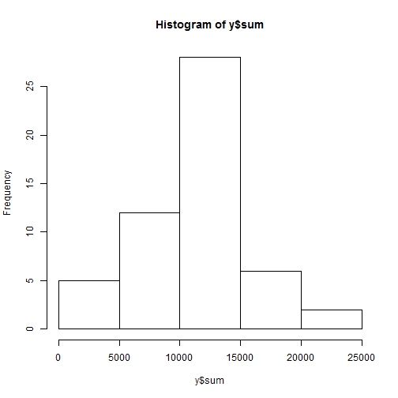
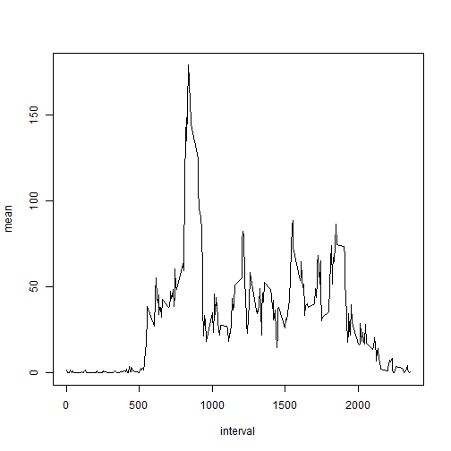
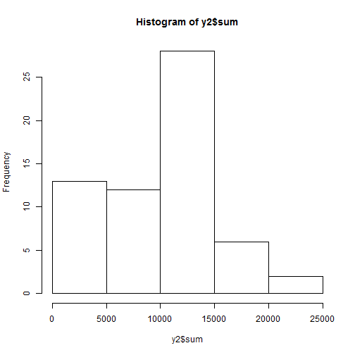

# Peer Assessment 1
By Carlos Figueroa

Setting Global Options for always show code:


```r
knitr::opts_chunk$set(echo=TRUE)
```

Reading data from working directory:


```r
setwd("C:\\Users\\figuca02\\datasciencecoursera\\rep-data-activity")
```

```
## Error in setwd("C:\\Users\\figuca02\\datasciencecoursera\\rep-data-activity"): cannot change working directory
```

```r
data<-read.csv("repdata-data-activity\\activity.csv", na.strings="NA")
```

Data summary (includes count of NA's):


```r
summary(data)
```

```
##      steps                date          interval     
##  Min.   :  0.00   2012-10-01:  288   Min.   :   0.0  
##  1st Qu.:  0.00   2012-10-02:  288   1st Qu.: 588.8  
##  Median :  0.00   2012-10-03:  288   Median :1177.5  
##  Mean   : 37.38   2012-10-04:  288   Mean   :1177.5  
##  3rd Qu.: 12.00   2012-10-05:  288   3rd Qu.:1766.2  
##  Max.   :806.00   2012-10-06:  288   Max.   :2355.0  
##  NA's   :2304     (Other)   :15840
```

```r
str(data)
```

```
## 'data.frame':	17568 obs. of  3 variables:
##  $ steps   : int  NA NA NA NA NA NA NA NA NA NA ...
##  $ date    : Factor w/ 61 levels "2012-10-01","2012-10-02",..: 1 1 1 1 1 1 1 1 1 1 ...
##  $ interval: int  0 5 10 15 20 25 30 35 40 45 ...
```

Summarizing steps by day and plotting histogram (Choosing not to ignore NA's since we can or cannot):


```r
library(plyr)
y<-ddply(data, ~date, summarise, sum=sum(steps))
y
```

```
##          date   sum
## 1  2012-10-01    NA
## 2  2012-10-02   126
## 3  2012-10-03 11352
## 4  2012-10-04 12116
## 5  2012-10-05 13294
## 6  2012-10-06 15420
## 7  2012-10-07 11015
## 8  2012-10-08    NA
## 9  2012-10-09 12811
## 10 2012-10-10  9900
## 11 2012-10-11 10304
## 12 2012-10-12 17382
## 13 2012-10-13 12426
## 14 2012-10-14 15098
## 15 2012-10-15 10139
## 16 2012-10-16 15084
## 17 2012-10-17 13452
## 18 2012-10-18 10056
## 19 2012-10-19 11829
## 20 2012-10-20 10395
## 21 2012-10-21  8821
## 22 2012-10-22 13460
## 23 2012-10-23  8918
## 24 2012-10-24  8355
## 25 2012-10-25  2492
## 26 2012-10-26  6778
## 27 2012-10-27 10119
## 28 2012-10-28 11458
## 29 2012-10-29  5018
## 30 2012-10-30  9819
## 31 2012-10-31 15414
## 32 2012-11-01    NA
## 33 2012-11-02 10600
## 34 2012-11-03 10571
## 35 2012-11-04    NA
## 36 2012-11-05 10439
## 37 2012-11-06  8334
## 38 2012-11-07 12883
## 39 2012-11-08  3219
## 40 2012-11-09    NA
## 41 2012-11-10    NA
## 42 2012-11-11 12608
## 43 2012-11-12 10765
## 44 2012-11-13  7336
## 45 2012-11-14    NA
## 46 2012-11-15    41
## 47 2012-11-16  5441
## 48 2012-11-17 14339
## 49 2012-11-18 15110
## 50 2012-11-19  8841
## 51 2012-11-20  4472
## 52 2012-11-21 12787
## 53 2012-11-22 20427
## 54 2012-11-23 21194
## 55 2012-11-24 14478
## 56 2012-11-25 11834
## 57 2012-11-26 11162
## 58 2012-11-27 13646
## 59 2012-11-28 10183
## 60 2012-11-29  7047
## 61 2012-11-30    NA
```

```r
hist(y$sum)
```

 

Summarizing steps by day and calculating mean and median for each one (Choosing not to ignore NA's since we can or cannot):


```r
x<-ddply(data, ~date, summarise, mean=mean(steps), median=median(steps))
x
```

```
##          date       mean median
## 1  2012-10-01         NA     NA
## 2  2012-10-02  0.4375000      0
## 3  2012-10-03 39.4166667      0
## 4  2012-10-04 42.0694444      0
## 5  2012-10-05 46.1597222      0
## 6  2012-10-06 53.5416667      0
## 7  2012-10-07 38.2465278      0
## 8  2012-10-08         NA     NA
## 9  2012-10-09 44.4826389      0
## 10 2012-10-10 34.3750000      0
## 11 2012-10-11 35.7777778      0
## 12 2012-10-12 60.3541667      0
## 13 2012-10-13 43.1458333      0
## 14 2012-10-14 52.4236111      0
## 15 2012-10-15 35.2048611      0
## 16 2012-10-16 52.3750000      0
## 17 2012-10-17 46.7083333      0
## 18 2012-10-18 34.9166667      0
## 19 2012-10-19 41.0729167      0
## 20 2012-10-20 36.0937500      0
## 21 2012-10-21 30.6284722      0
## 22 2012-10-22 46.7361111      0
## 23 2012-10-23 30.9652778      0
## 24 2012-10-24 29.0104167      0
## 25 2012-10-25  8.6527778      0
## 26 2012-10-26 23.5347222      0
## 27 2012-10-27 35.1354167      0
## 28 2012-10-28 39.7847222      0
## 29 2012-10-29 17.4236111      0
## 30 2012-10-30 34.0937500      0
## 31 2012-10-31 53.5208333      0
## 32 2012-11-01         NA     NA
## 33 2012-11-02 36.8055556      0
## 34 2012-11-03 36.7048611      0
## 35 2012-11-04         NA     NA
## 36 2012-11-05 36.2465278      0
## 37 2012-11-06 28.9375000      0
## 38 2012-11-07 44.7326389      0
## 39 2012-11-08 11.1770833      0
## 40 2012-11-09         NA     NA
## 41 2012-11-10         NA     NA
## 42 2012-11-11 43.7777778      0
## 43 2012-11-12 37.3784722      0
## 44 2012-11-13 25.4722222      0
## 45 2012-11-14         NA     NA
## 46 2012-11-15  0.1423611      0
## 47 2012-11-16 18.8923611      0
## 48 2012-11-17 49.7881944      0
## 49 2012-11-18 52.4652778      0
## 50 2012-11-19 30.6979167      0
## 51 2012-11-20 15.5277778      0
## 52 2012-11-21 44.3993056      0
## 53 2012-11-22 70.9270833      0
## 54 2012-11-23 73.5902778      0
## 55 2012-11-24 50.2708333      0
## 56 2012-11-25 41.0902778      0
## 57 2012-11-26 38.7569444      0
## 58 2012-11-27 47.3819444      0
## 59 2012-11-28 35.3576389      0
## 60 2012-11-29 24.4687500      0
## 61 2012-11-30         NA     NA
```

Summarizing steps by 5-minute interval and calculating mean (changing NA's to zeros which counts for the "Imputing missing values" and creating a new data set ): 


```r
newdata<-data
summary(newdata)
```

```
##      steps                date          interval     
##  Min.   :  0.00   2012-10-01:  288   Min.   :   0.0  
##  1st Qu.:  0.00   2012-10-02:  288   1st Qu.: 588.8  
##  Median :  0.00   2012-10-03:  288   Median :1177.5  
##  Mean   : 37.38   2012-10-04:  288   Mean   :1177.5  
##  3rd Qu.: 12.00   2012-10-05:  288   3rd Qu.:1766.2  
##  Max.   :806.00   2012-10-06:  288   Max.   :2355.0  
##  NA's   :2304     (Other)   :15840
```

```r
## Same as the original data
newdata[is.na(newdata)]<-0
z<-ddply(newdata, ~interval, summarise, mean=mean(steps))
z
```

```
##     interval         mean
## 1          0   1.49180328
## 2          5   0.29508197
## 3         10   0.11475410
## 4         15   0.13114754
## 5         20   0.06557377
## 6         25   1.81967213
## 7         30   0.45901639
## 8         35   0.75409836
## 9         40   0.00000000
## 10        45   1.27868852
## 11        50   0.26229508
## 12        55   0.11475410
## 13       100   0.27868852
## 14       105   0.59016393
## 15       110   0.13114754
## 16       115   0.29508197
## 17       120   0.00000000
## 18       125   0.96721311
## 19       130   1.59016393
## 20       135   0.14754098
## 21       140   0.14754098
## 22       145   0.32786885
## 23       150   0.22950820
## 24       155   0.00000000
## 25       200   0.00000000
## 26       205   0.00000000
## 27       210   0.98360656
## 28       215   0.00000000
## 29       220   0.00000000
## 30       225   0.11475410
## 31       230   0.00000000
## 32       235   0.19672131
## 33       240   0.00000000
## 34       245   0.00000000
## 35       250   1.34426230
## 36       255   0.81967213
## 37       300   0.00000000
## 38       305   0.00000000
## 39       310   0.00000000
## 40       315   0.00000000
## 41       320   0.18032787
## 42       325   0.54098361
## 43       330   1.40983607
## 44       335   0.50819672
## 45       340   0.42622951
## 46       345   0.06557377
## 47       350   0.00000000
## 48       355   0.00000000
## 49       400   1.03278689
## 50       405   0.81967213
## 51       410   2.22950820
## 52       415   0.00000000
## 53       420   0.29508197
## 54       425   0.31147541
## 55       430   3.57377049
## 56       435   0.57377049
## 57       440   3.03278689
## 58       445   0.72131148
## 59       450   2.70491803
## 60       455   0.96721311
## 61       500   0.00000000
## 62       505   1.36065574
## 63       510   2.60655738
## 64       515   1.95081967
## 65       520   2.88524590
## 66       525   2.57377049
## 67       530   1.81967213
## 68       535   5.26229508
## 69       540  13.91803279
## 70       545  15.93442623
## 71       550  34.27868852
## 72       555  38.65573770
## 73       600  27.36065574
## 74       605  42.80327869
## 75       610  46.72131148
## 76       615  55.13114754
## 77       620  43.40983607
## 78       625  40.90163934
## 79       630  45.31147541
## 80       635  34.18032787
## 81       640  38.24590164
## 82       645  38.37704918
## 83       650  32.45901639
## 84       655  42.60655738
## 85       700  38.06557377
## 86       705  38.55737705
## 87       710  43.88524590
## 88       715  47.36065574
## 89       720  43.37704918
## 90       725  44.29508197
## 91       730  48.37704918
## 92       735  38.50819672
## 93       740  45.40983607
## 94       745  60.42622951
## 95       750  50.26229508
## 96       755  48.78688525
## 97       800  63.75409836
## 98       805  59.26229508
## 99       810 112.45901639
## 100      815 136.86885246
## 101      820 148.70491803
## 102      825 135.01639344
## 103      830 154.04918033
## 104      835 179.13114754
## 105      840 170.22950820
## 106      845 156.01639344
## 107      850 159.34426230
## 108      855 145.11475410
## 109      900 124.63934426
## 110      905 107.77049180
## 111      910  94.80327869
## 112      915  93.93442623
## 113      920  90.11475410
## 114      925  83.37704918
## 115      930  57.52459016
## 116      935  39.29508197
## 117      940  21.54098361
## 118      945  33.67213115
## 119      950  30.39344262
## 120      955  18.29508197
## 121     1000  35.24590164
## 122     1005  23.44262295
## 123     1010  36.85245902
## 124     1015  45.75409836
## 125     1020  33.81967213
## 126     1025  44.13114754
## 127     1030  38.47540984
## 128     1035  32.50819672
## 129     1040  30.14754098
## 130     1045  24.62295082
## 131     1050  21.80327869
## 132     1055  27.75409836
## 133     1100  27.24590164
## 134     1105  25.78688525
## 135     1110  18.52459016
## 136     1115  22.19672131
## 137     1120  24.65573770
## 138     1125  23.00000000
## 139     1130  29.04918033
## 140     1135  43.42622951
## 141     1140  36.52459016
## 142     1145  38.75409836
## 143     1150  40.00000000
## 144     1155  51.42622951
## 145     1200  55.49180328
## 146     1205  76.19672131
## 147     1210  82.40983607
## 148     1215  80.60655738
## 149     1220  55.08196721
## 150     1225  43.59016393
## 151     1230  47.32786885
## 152     1235  28.16393443
## 153     1240  23.04918033
## 154     1245  32.78688525
## 155     1250  39.14754098
## 156     1255  58.45901639
## 157     1300  36.78688525
## 158     1305  34.65573770
## 159     1310  37.59016393
## 160     1315  35.60655738
## 161     1320  40.18032787
## 162     1325  49.03278689
## 163     1330  37.14754098
## 164     1335  21.83606557
## 165     1340  34.72131148
## 166     1345  46.52459016
## 167     1350  41.11475410
## 168     1355  52.83606557
## 169     1400  48.44262295
## 170     1405  45.14754098
## 171     1410  37.86885246
## 172     1415  42.31147541
## 173     1420  30.81967213
## 174     1425  32.62295082
## 175     1430  36.36065574
## 176     1435  23.90163934
## 177     1440  14.86885246
## 178     1445  22.65573770
## 179     1450  37.90163934
## 180     1455  38.03278689
## 181     1500  26.08196721
## 182     1505  31.34426230
## 183     1510  30.83606557
## 184     1515  33.75409836
## 185     1520  39.93442623
## 186     1525  41.49180328
## 187     1530  41.81967213
## 188     1535  56.75409836
## 189     1540  72.03278689
## 190     1545  85.72131148
## 191     1550  88.72131148
## 192     1555  72.95081967
## 193     1600  53.98360656
## 194     1605  55.72131148
## 195     1610  64.77049180
## 196     1615  54.88524590
## 197     1620  49.44262295
## 198     1625  51.93442623
## 199     1630  38.11475410
## 200     1635  33.50819672
## 201     1640  38.80327869
## 202     1645  39.49180328
## 203     1650  40.14754098
## 204     1655  37.95081967
## 205     1700  40.50819672
## 206     1705  48.91803279
## 207     1710  44.06557377
## 208     1715  53.19672131
## 209     1720  63.18032787
## 210     1725  68.59016393
## 211     1730  59.90163934
## 212     1735  51.83606557
## 213     1740  65.24590164
## 214     1745  49.09836066
## 215     1750  30.21311475
## 216     1755  32.54098361
## 217     1800  35.34426230
## 218     1805  50.40983607
## 219     1810  64.90163934
## 220     1815  74.13114754
## 221     1820  51.49180328
## 222     1825  58.88524590
## 223     1830  67.50819672
## 224     1835  64.50819672
## 225     1840  74.14754098
## 226     1845  86.40983607
## 227     1850  75.22950820
## 228     1855  74.37704918
## 229     1900  73.73770492
## 230     1905  67.62295082
## 231     1910  50.42622951
## 232     1915  46.36065574
## 233     1920  31.55737705
## 234     1925  18.00000000
## 235     1930  23.80327869
## 236     1935  34.77049180
## 237     1940  26.24590164
## 238     1945  22.19672131
## 239     1950  39.67213115
## 240     1955  29.13114754
## 241     2000  17.04918033
## 242     2005  16.52459016
## 243     2010  16.80327869
## 244     2015  28.96721311
## 245     2020  23.29508197
## 246     2025  18.39344262
## 247     2030  23.72131148
## 248     2035  18.54098361
## 249     2040  16.98360656
## 250     2045  18.52459016
## 251     2050  28.06557377
## 252     2055  17.50819672
## 253     2100  13.85245902
## 254     2105  14.96721311
## 255     2110  20.37704918
## 256     2115  16.72131148
## 257     2120  10.81967213
## 258     2125   6.96721311
## 259     2130  12.73770492
## 260     2135  14.16393443
## 261     2140   7.54098361
## 262     2145   6.77049180
## 263     2150   7.06557377
## 264     2155   2.27868852
## 265     2200   1.26229508
## 266     2205   3.19672131
## 267     2210   4.18032787
## 268     2215   7.39344262
## 269     2220   6.14754098
## 270     2225   7.55737705
## 271     2230   8.47540984
## 272     2235   1.91803279
## 273     2240   0.27868852
## 274     2245   0.09836066
## 275     2250   1.39344262
## 276     2255   4.00000000
## 277     2300   2.86885246
## 278     2305   2.47540984
## 279     2310   0.00000000
## 280     2315   0.72131148
## 281     2320   0.83606557
## 282     2325   1.37704918
## 283     2330   2.26229508
## 284     2335   4.08196721
## 285     2340   2.86885246
## 286     2345   0.55737705
## 287     2350   0.19672131
## 288     2355   0.93442623
```

Plotting mean steps by interval:


```r
with(z, {plot(interval, mean, type="l")})
```

 

The maximum mean is on interval 835

The total number of NA's was already informed in the summary after reading data, there are 2,304 lines with NA, a new set with imputation was created also prevously for summarizing data by interval and step average so will go straight to the new mean, median and histogram


Strategy
I replaced all NA's with zeros because I assume they came from a non measure caused by inmovility, i.e. the test subject was still for a long time inducing a measurement error which caused NA instead of zero


Histogram


```r
y2<-ddply(newdata, ~date, summarise, sum=sum(steps))
y2
```

```
##          date   sum
## 1  2012-10-01     0
## 2  2012-10-02   126
## 3  2012-10-03 11352
## 4  2012-10-04 12116
## 5  2012-10-05 13294
## 6  2012-10-06 15420
## 7  2012-10-07 11015
## 8  2012-10-08     0
## 9  2012-10-09 12811
## 10 2012-10-10  9900
## 11 2012-10-11 10304
## 12 2012-10-12 17382
## 13 2012-10-13 12426
## 14 2012-10-14 15098
## 15 2012-10-15 10139
## 16 2012-10-16 15084
## 17 2012-10-17 13452
## 18 2012-10-18 10056
## 19 2012-10-19 11829
## 20 2012-10-20 10395
## 21 2012-10-21  8821
## 22 2012-10-22 13460
## 23 2012-10-23  8918
## 24 2012-10-24  8355
## 25 2012-10-25  2492
## 26 2012-10-26  6778
## 27 2012-10-27 10119
## 28 2012-10-28 11458
## 29 2012-10-29  5018
## 30 2012-10-30  9819
## 31 2012-10-31 15414
## 32 2012-11-01     0
## 33 2012-11-02 10600
## 34 2012-11-03 10571
## 35 2012-11-04     0
## 36 2012-11-05 10439
## 37 2012-11-06  8334
## 38 2012-11-07 12883
## 39 2012-11-08  3219
## 40 2012-11-09     0
## 41 2012-11-10     0
## 42 2012-11-11 12608
## 43 2012-11-12 10765
## 44 2012-11-13  7336
## 45 2012-11-14     0
## 46 2012-11-15    41
## 47 2012-11-16  5441
## 48 2012-11-17 14339
## 49 2012-11-18 15110
## 50 2012-11-19  8841
## 51 2012-11-20  4472
## 52 2012-11-21 12787
## 53 2012-11-22 20427
## 54 2012-11-23 21194
## 55 2012-11-24 14478
## 56 2012-11-25 11834
## 57 2012-11-26 11162
## 58 2012-11-27 13646
## 59 2012-11-28 10183
## 60 2012-11-29  7047
## 61 2012-11-30     0
```

```r
hist(y2$sum)
```

 


Mean and median


```r
x2<-ddply(newdata, ~date, summarise, mean=mean(steps), median=median(steps))
x2
```

```
##          date       mean median
## 1  2012-10-01  0.0000000      0
## 2  2012-10-02  0.4375000      0
## 3  2012-10-03 39.4166667      0
## 4  2012-10-04 42.0694444      0
## 5  2012-10-05 46.1597222      0
## 6  2012-10-06 53.5416667      0
## 7  2012-10-07 38.2465278      0
## 8  2012-10-08  0.0000000      0
## 9  2012-10-09 44.4826389      0
## 10 2012-10-10 34.3750000      0
## 11 2012-10-11 35.7777778      0
## 12 2012-10-12 60.3541667      0
## 13 2012-10-13 43.1458333      0
## 14 2012-10-14 52.4236111      0
## 15 2012-10-15 35.2048611      0
## 16 2012-10-16 52.3750000      0
## 17 2012-10-17 46.7083333      0
## 18 2012-10-18 34.9166667      0
## 19 2012-10-19 41.0729167      0
## 20 2012-10-20 36.0937500      0
## 21 2012-10-21 30.6284722      0
## 22 2012-10-22 46.7361111      0
## 23 2012-10-23 30.9652778      0
## 24 2012-10-24 29.0104167      0
## 25 2012-10-25  8.6527778      0
## 26 2012-10-26 23.5347222      0
## 27 2012-10-27 35.1354167      0
## 28 2012-10-28 39.7847222      0
## 29 2012-10-29 17.4236111      0
## 30 2012-10-30 34.0937500      0
## 31 2012-10-31 53.5208333      0
## 32 2012-11-01  0.0000000      0
## 33 2012-11-02 36.8055556      0
## 34 2012-11-03 36.7048611      0
## 35 2012-11-04  0.0000000      0
## 36 2012-11-05 36.2465278      0
## 37 2012-11-06 28.9375000      0
## 38 2012-11-07 44.7326389      0
## 39 2012-11-08 11.1770833      0
## 40 2012-11-09  0.0000000      0
## 41 2012-11-10  0.0000000      0
## 42 2012-11-11 43.7777778      0
## 43 2012-11-12 37.3784722      0
## 44 2012-11-13 25.4722222      0
## 45 2012-11-14  0.0000000      0
## 46 2012-11-15  0.1423611      0
## 47 2012-11-16 18.8923611      0
## 48 2012-11-17 49.7881944      0
## 49 2012-11-18 52.4652778      0
## 50 2012-11-19 30.6979167      0
## 51 2012-11-20 15.5277778      0
## 52 2012-11-21 44.3993056      0
## 53 2012-11-22 70.9270833      0
## 54 2012-11-23 73.5902778      0
## 55 2012-11-24 50.2708333      0
## 56 2012-11-25 41.0902778      0
## 57 2012-11-26 38.7569444      0
## 58 2012-11-27 47.3819444      0
## 59 2012-11-28 35.3576389      0
## 60 2012-11-29 24.4687500      0
## 61 2012-11-30  0.0000000      0
```

There is no difference because of the specific way I did Things (sorry, didnt' read the whole assignment first) but as we replace NA's with imputed values above or below the mean we slightly increase or decrase it (in this case, as I used zeros, everything decrease)


Since Im in a hurry i will skip the last part, sorry, my bad! :( 


```r
library(knitr)
knit2html(input="PA1_template.rmd", output="PA1_template.html")
```

```
## 
## 
## processing file: PA1_template.rmd
```

```
## Error in parse_block(g[-1], g[1], params.src): duplicate label 'global_options'
```


